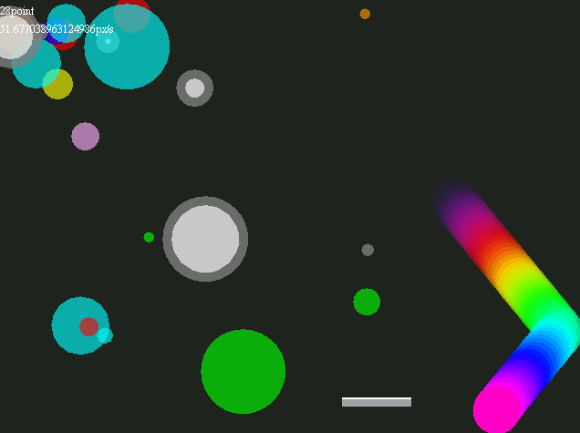

CrazyDancingBall
================

###Latest Version
[1.0](https://github.com/ryo33/CrazyDancingBall/releases/tag/1.0 "First Release")
###Description
    simple ball game  
    hit to point balls to get point
###Requirement
    JRE
###Install
    clone this
###Usage
    compile "Main.java" and execute
    ##Keys  
    WASD: control  
    Esc: pause
###Future
    add fx
###Author
[ryo33](https://github.com/ryo33/ "ryo33's github page")
